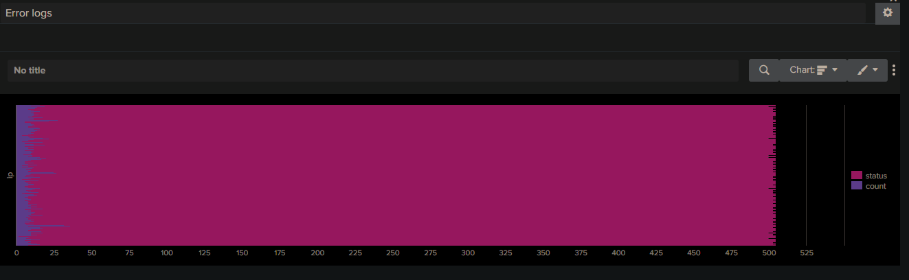
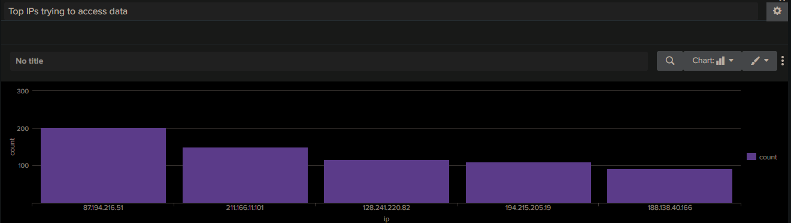

# SOC Detection Lab using Splunk

## Overview
This project demonstrates basic SOC operations using Splunk by analyzing web server logs.

## Objectives
- Identify suspicious IP activity
- Detect reconnaissance behavior using HTTP status codes
- Monitor abnormal traffic patterns

## Key Use Cases
- Detection of high 404 responses (possible directory scanning)
- Identification of IPs generating repeated 403 errors
- Analysis of request frequency and access patterns

## Tools Used
- Splunk
- Sample web server logs

## Sample Queries
### Top Suspicious IPs
index=* sourcetype="access_combined_wcookie" status>=400
| stats count by ip
| sort - count

index=* sourcetype="access_combined_wcookie" ip="192.168.1.20"
| table _time ip status uri
| sort - _time

## Attack Scenarios Simulated
### 1. Reconnaissance Attack
- Multiple 404 requests from same IP
- Indicates directory scanning

### 2. Unauthorized Access Attempts
- Repeated 403 responses
- Attempt to access restricted resources

### 3. Suspicious Sensitive Access
- Access to /admin, /config, /backup.zip with status 200
- Potential exposure of sensitive data

- ## Analysis
- High 404 responses indicate scanning behavior
- 403 responses suggest restricted access attempts
- Combination of 404 + 403 + 200 shows attacker discovering valid endpoints

## Screenshots
##Error Analysis

##Failed Logins

##Top IPs Trying to Access

## Conclusion
This project simulates real-world SOC analysis by identifying suspicious patterns and investigating attacker behavior using log data.
